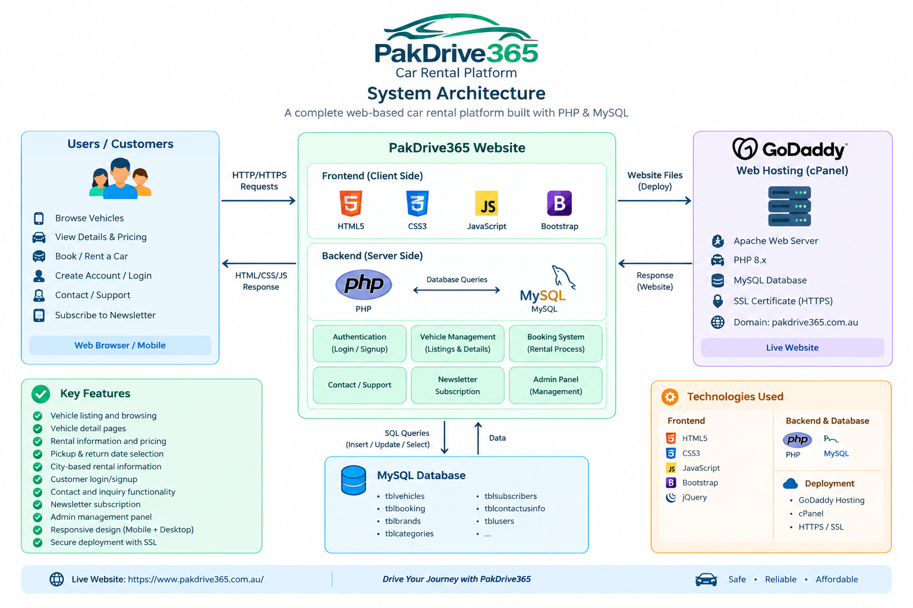

# PakDrive365 — Production Car Rental Platform

> A production car-rental website customized, integrated, and deployed for a real business.

**Live Website:** https://www.pakdrive365.com.au/

---

## 📌 Project Overview

**PakDrive365** is a web-based car-rental platform developed and deployed for a real business.

The platform allows customers to:

- Browse available vehicles
- View vehicle details
- Review rental pricing and information
- Select rental-related information
- Submit booking-related requests
- Contact the business
- Subscribe to newsletter updates
- Access the platform through responsive web interfaces

The application was customized and integrated with a **PHP/MySQL backend** and deployed to a live hosting environment.

This repository is intentionally maintained as a **portfolio/case-study repository** rather than a complete copy of the production application.

---

## 🌐 Live Website

Visit the deployed application:

**https://www.pakdrive365.com.au/**

---

## 👨‍💻 My Role

I worked on the customization, integration, deployment, and maintenance of the PakDrive365 platform.

My responsibilities included:

- Customizing the car-rental website for the business
- Frontend UI customization
- Responsive page development and adjustments
- PHP backend integration
- MySQL database integration
- Vehicle listing and rental information management
- Vehicle detail page customization
- Booking-related functionality
- Contact and inquiry functionality
- Customer authentication-related functionality
- Newsletter subscription functionality
- Website structure and navigation customization
- Production hosting configuration
- Domain and DNS configuration
- HTTPS/SSL deployment
- SEO-related website setup
- Production maintenance and updates

---

## ✨ Key Features

### Customer Features

- Vehicle listing and browsing
- Vehicle detail pages
- Rental information and pricing
- Pickup and return date selection
- City-based rental information
- Customer login/signup functionality
- Contact and inquiry functionality
- Newsletter subscription
- Responsive design

### Management Features

- Vehicle management
- Rental/booking-related management
- Customer-related management
- Contact/inquiry management
- Newsletter subscriber management
- Administrative interface

### Production Features

- Custom domain
- HTTPS / SSL
- PHP/MySQL backend
- Apache-based hosting
- cPanel hosting environment
- Production database integration
- Responsive frontend

---

## 🛠️ Technology Stack

### Frontend

- HTML5
- CSS3
- JavaScript
- Bootstrap
- jQuery

### Backend

- PHP
- MySQL

### Web Server & Hosting

- Apache
- cPanel-based hosting
- HTTPS / SSL
- Custom domain

### Development & Version Control

- Git
- GitHub
- Visual Studio Code

---

## 🏗️ Project Architecture

The following diagram provides a high-level overview of the production architecture.



### High-Level Architecture

```text
                         ┌──────────────────────┐
                         │      Customers       │
                         │                      │
                         │ • Browse Vehicles    │
                         │ • View Details       │
                         │ • Rental Information │
                         │ • Booking Requests   │
                         │ • Contact Business   │
                         └──────────┬───────────┘
                                    │
                                    ▼
                         ┌──────────────────────┐
                         │   PakDrive365 Web    │
                         │      Platform        │
                         └──────────┬───────────┘
                                    │
                     ┌──────────────┴──────────────┐
                     │                             │
                     ▼                             ▼
             ┌────────────────┐          ┌────────────────┐
             │    Frontend    │          │ PHP Application│
             │                │          │                │
             │ HTML5          │          │ Authentication │
             │ CSS3           │          │ Vehicles       │
             │ JavaScript     │          │ Booking Logic  │
             │ Bootstrap      │          │ Contact        │
             │ jQuery         │          │ Admin          │
             └────────────────┘          └───────┬────────┘
                                                  │
                                                  ▼
                                         ┌────────────────┐
                                         │ MySQL Database │
                                         │                │
                                         │ Vehicles       │
                                         │ Bookings       │
                                         │ Users          │
                                         │ Categories     │
                                         │ Subscribers    │
                                         │ Contact Data   │
                                         └───────┬────────┘
                                                 │
                                                 ▼
                                      ┌────────────────────┐
                                      │ Production Hosting │
                                      │                    │
                                      │ Apache             │
                                      │ PHP                │
                                      │ MySQL              │
                                      │ cPanel             │
                                      │ HTTPS / SSL        │
                                      └────────────────────┘
````

---

## 📸 Screenshots

The following screenshots demonstrate the main areas of the deployed platform.

### 🏠 Homepage


The homepage provides an overview of the rental service, vehicle offerings, navigation, and customer entry points.

---

### 🚗 Vehicle Listings


The vehicle listing interface allows customers to browse available rental vehicles and review relevant rental information.

---

### 🚘 Vehicle Details


The vehicle details page provides more information about an individual vehicle, including its rental information and available details.

---

### 📅 Booking / Rental Request


The booking-related interface allows customers to provide rental information such as dates and other required details.

> No real customer information is included in this portfolio screenshot.

---

### 🔐 Customer Authentication


Customer authentication functionality includes login/signup-related interfaces.

---

### 📩 Contact & Inquiry


The contact interface allows customers to communicate with the business and submit inquiries.

---

### 🛠️ Admin Dashboard


The administrative interface provides management functionality for areas such as vehicles, bookings, customers, and inquiries.

> Sensitive customer information and administrative credentials are not included in the portfolio repository.

---

### 📱 Responsive Design


The platform was customized to provide a responsive experience across desktop and mobile screen sizes.

---

## 📁 Portfolio Repository Structure

```text
PakDrive365-Car-Rental/
│
├── README.md
│
├── Screenshots/
│   ├── homepage.png
│   ├── vehicles.png
│   ├── vehicle-details.png
│   ├── booking.png
│   ├── login.png
│   ├── contact.png
│   ├── admin-dashboard.png
│   └── mobile-responsive.png
│
└── doc/
    └── architecture.png
```

This repository structure is intentionally limited to portfolio documentation and selected visual materials.

The complete production application is maintained separately.

---

## 🚀 Production & Deployment

The PakDrive365 platform was deployed to a live hosting environment with a custom domain.

### Production Environment

* Custom domain: `pakdrive365.com.au`
* Apache web server
* PHP runtime
* MySQL database
* cPanel-based hosting
* HTTPS / SSL
* DNS configuration
* Production database integration

### Deployment Workflow

```text
Local Development
       │
       ▼
PHP / MySQL Application
       │
       ▼
Testing & Configuration
       │
       ▼
Hosting / cPanel
       │
       ▼
Domain & DNS Configuration
       │
       ▼
HTTPS / SSL
       │
       ▼
Live Production Website
```

### Live Application

**[https://www.pakdrive365.com.au/](https://www.pakdrive365.com.au/)**

---

## 🔐 Security & Privacy

Because PakDrive365 is a real production business application, sensitive production information is intentionally excluded from this public repository.

The repository does **not** contain:

* Database credentials
* Hosting credentials
* cPanel credentials
* FTP/SFTP credentials
* API keys or tokens
* Environment secrets
* Production database dumps
* Customer personal information
* Customer booking records
* Administrative passwords
* Private client documents
* Private server configuration
* Other sensitive production information

Screenshots included in this repository should contain only appropriate demo/portfolio information.

---

## 📜 Third-Party Components & Ownership

The production application incorporates third-party libraries, frameworks, templates, plugins, and other components where applicable.

Their respective ownership and licensing terms remain applicable.

This public repository is intentionally limited to portfolio documentation, screenshots, architecture information, and other materials appropriate for public presentation.

It does not redistribute the complete production application or complete third-party template/source package.

---

## 💡 Technical Highlights

This project provided practical experience with:

* PHP-based web application development
* MySQL database integration
* Server-side application functionality
* Database-driven vehicle listings
* Customer authentication
* Booking-related workflows
* Contact and inquiry processing
* Administrative functionality
* Responsive web development
* Production deployment
* Domain configuration
* DNS configuration
* HTTPS / SSL configuration
* cPanel hosting
* Apache web server
* Git and GitHub
* Production application maintenance

---

## 📈 Future Improvements

Potential future improvements for the platform include:

* Online payment integration
* Automated booking confirmation emails
* Improved vehicle availability management
* Customer dashboard
* Advanced booking management
* Automated notifications
* Reporting and analytics dashboard
* REST API integration
* Improved application performance
* Automated testing
* Enhanced authentication and security
* Improved booking workflow
* More advanced search and filtering

---

## 🎯 Project Purpose

This project demonstrates practical experience in taking a web application from development and customization through to **production deployment and ongoing maintenance**.

It combines:

```text
Frontend Development
        +
PHP Backend
        +
MySQL Database
        +
Web Hosting
        +
Domain & DNS Configuration
        +
HTTPS / SSL
        +
Production Maintenance
```

The project therefore represents both **software development** and **real-world deployment experience**.

---

## 📌 Portfolio Disclaimer

PakDrive365 is a real business project.

The business, production website, branding, client information, and production data are not claimed as personal intellectual property of the portfolio author.

This repository is provided for professional portfolio and case-study purposes and contains only selected documentation and visual materials appropriate for public presentation.

---

## 🌐 Links

**Live Website:**
[https://www.pakdrive365.com.au/](https://www.pakdrive365.com.au/)

**GitHub Portfolio Repository:**
[https://github.com/AlizarKhan62/PakDrive365-Car-Rental](https://github.com/AlizarKhan62/PakDrive365-Car-Rental)

---

## 👨‍💻 Author

**Alizar Khan**

Computer Science Graduate | Python | Data Science | Web Development | Backend Development

**GitHub:**
[https://github.com/AlizarKhan62](https://github.com/AlizarKhan62)

**LinkedIn:**
[https://www.linkedin.com/in/alizar-khan-6278142a8/](https://www.linkedin.com/in/alizar-khan-6278142a8/)

````

